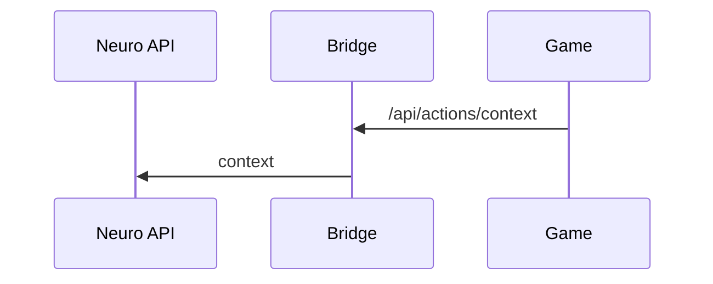
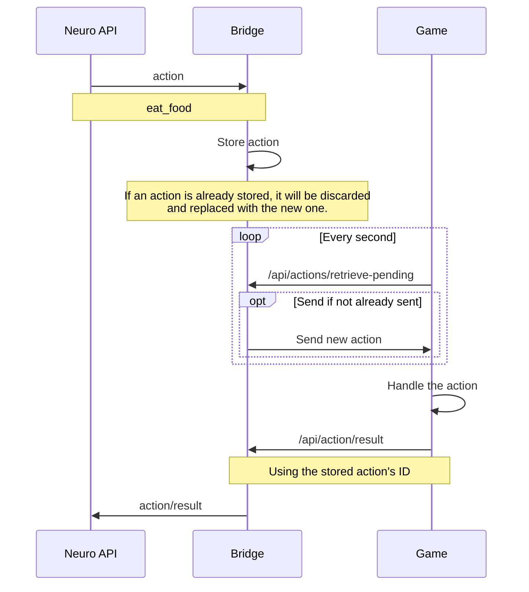

# API Bridge Overview

These are some high level overviews on how the API Bridge works.

> [!IMPORTANT]
> The reason the API Bridge exists is that Don't Starve doesn't natively support WebSocket connections, only HTTP requests and only for POST and GET.

## Sending Context

> [!IMPORTANT]
> This example assumes that the player has taken damage/is being attacked

## Receiving Actions

> [!IMPORTANT]
> This example assumes that Neuro is sending an action to eat food,
> but this will act the same for forced actions, registering actions, etc.

